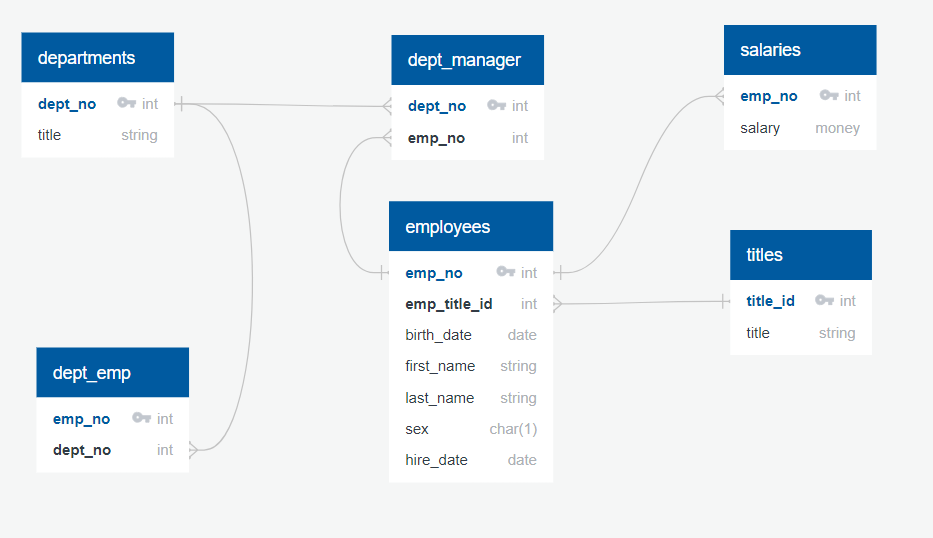

# SQL Challenge

This repository contains the SQL Challenge project, which includes data engineering, analysis, and database schema design tasks.

## Project Structure

- **data**: Directory containing data files for the challenge.
- **QuickDBD.png**: Database schema design.
- **data-analysis.txt**: Analysis results and insights.
- **data-engineering.txt**: Data engineering steps and processes.
- **quickdbd.txt**: Text version of the database schema design.

## Getting Started

1. Clone the repository:
    ```sh
    git clone https://github.com/RafiPratomo/sql-challenge.git
    cd sql-challenge
    ```
2. Review the `data-engineering.txt` for steps on setting up the database and importing data.
3. Refer to `data-analysis.txt` for analysis insights.

## Database Schema



## Contributing

Feel free to submit issues or pull requests. For major changes, please open an issue first to discuss what you would like to change.

## License

This project is licensed under the MIT License.
